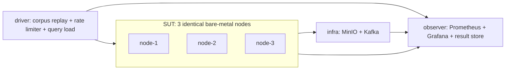

# Logwar benchmark plan (on-prem)

How we settle the logging engine choice with evidence. Companion documents:
[revise-syscon.txt](revise-syscon.txt) (decisions and open questions),
[explanation.md](explanation.md) (why the original assumptions changed),
[corpus-spec.md](corpus-spec.md) (the dataset),
[queries/matrix.md](queries/matrix.md) (the query suite),
[phase1a-clickhouse-ingest.md](phase1a-clickhouse-ingest.md) (the ClickHouse ingest-pipeline
shakedown that runs before phase 1),
[notebook/logging-decision-handbook.md](notebook/logging-decision-handbook.md) (the deliverable).

Candidates and pinned versions:

| Engine | Version | Non-negotiable configuration |
| --- | --- | --- |
| Elasticsearch | 9.x | `index.mode: logsdb`, sort `host.name` then `@timestamp` |
| Grafana Loki | 3.5.x | distributed mode, TSDB + schema v13, object store |
| ClickHouse | >= 26.2 | text index GA, `PARTITION BY toDate()`, explicit DDL |
| VictoriaLogs | current | cluster mode; tier 2 = two independent clusters |

Version pinning is not cosmetic. ClickHouse text indexes are beta before 26.2,
Elasticsearch `logsdb` changes storage by 2-4x, and Loki 4.0 removes the Simple Scalable
deployment mode, so benchmarking SSD would measure a topology that is being deleted.

---

## 1. The first four criteria, ranked

Ranked deliberately: a failure at criterion 1 cannot be compensated by a win at criterion
2, and a criterion 3 number measured at unequal durability is not a number at all.

### C1 — Search semantics and correctness (gate)

**Question:** can the engine express the queries we need, and does it return the *same
rows* as the others?

This is a pass/fail gate, not a score. The reason it ranks first is in
[explanation.md §1.5](explanation.md): `a b = b a` unordered search is not one operation.
Loki's `|=` is substring matching, while Elasticsearch `match`/`operator:and`, ClickHouse
`hasAllTokens` and VictoriaLogs word filters are token matching. An engine that returns
fewer rows looks faster, so unless result sets are asserted equal, every latency number
downstream is fiction.

Pass conditions, all required:

1. The query is expressible. Workarounds are allowed but recorded as such.
2. Result **count is identical** to the reference engine on the 5GB slice, or the
   difference is explained by a documented semantic difference and accepted.
   (Q14-Q16 are gated on expressibility only at this stage; their ground-truth scoring needs
   the planted incidents, which only exist in the full corpus.)
3. The query demonstrably **uses an index** where the engine claims to have one, proven by
   the per-engine command in [queries/matrix.md](queries/matrix.md) (`EXPLAIN indexes=1`,
   ES `profile: true`, Loki response `Summary` stats, VictoriaLogs query stats).
4. Multi-line events (Java stack traces) are searchable as one logical event.

Output: a capability matrix. Engines failing a *required* query class are eliminated before
phase 1 and do not consume rig time.

### C2 — Query performance per unit of hardware

**Question:** what does a query cost, and how does that scale?

Measured per query class in [queries/matrix.md](queries/matrix.md), across three
independent axes:

- **Selectivity:** planted needles at 1 hit in 10^9, 10^7, 10^5 events.
- **Time window:** 1h, 24h, 7d (7d touches the whole corpus — the cost ceiling).
- **Concurrency:** 1, 10, 50 simultaneous queries.

Recorded for every run:

| Metric | Why it matters |
| --- | --- |
| p50 / p95 / p99 wall time | what the engineer experiences |
| **cluster-wide CPU-seconds per query** | the only figure that transfers to other hardware |
| bytes scanned / decompressed | explains the mechanism, predicts behaviour at other volumes |
| bytes + request count from object store, p99 TTFB | settles the "is S3 slow" argument |
| peak RSS per component | sizing, and OOM risk under concurrency |
| cold vs warm cache, reported separately | never averaged; the gap is itself a result |

Wall time alone is a trap: it rewards whichever engine we happened to give more cores to.
CPU-seconds per query is what lets the handbook say "at 5TB/day you need N cores".

### C3 — Ingest cost and durability, normalized

**Question:** what does it cost to accept our write volume without losing data?

The fairness rule that makes or breaks this criterion: **an engine with weaker durability
must not be allowed to win throughput for free.** Every engine is therefore measured at
two tiers.

| Tier | Definition | ES | Loki | ClickHouse | VictoriaLogs |
| --- | --- | --- | --- | --- | --- |
| T1 | single copy | 1 primary, 0 replicas | `replication_factor: 1` | plain MergeTree | 1 cluster |
| T2 | survives one node loss | 1 primary + 1 replica | `replication_factor: 3` | ReplicatedMergeTree x2 + Keeper | **2 independent clusters** |

VictoriaLogs' T2 is two whole clusters because `vlinsert` shards without replicating, by
design ([cluster docs](https://docs.victoriametrics.com/victorialogs/cluster/)). That 2x
hardware multiplier is a headline result, not a footnote — see
[explanation.md §1.6](explanation.md).

Measured:

- Sustained ingest **MB/s and events/s per core** at each tier (find the knee: raise load
  until p99 ingest latency degrades or errors appear, then report 100% and the sustainable
  80%).
- **Back-pressure behaviour past the knee**, described not scored: HTTP 429, shipper lag,
  queue growth, OOM, or silent drops. Silent drops are a disqualifying finding.
- **Ingest-to-visible latency** p50/p99 via a timestamped canary, at the batching
  configuration we would actually run. This replaces the architectural argument about
  Elasticsearch refresh vs ClickHouse parts ([explanation.md §4.2](explanation.md)).
- **On-disk bytes per raw GB** including indexes, after merges settle.
- **Acked-but-lost count** under `kill -9` of one storage/ingest node mid-ingest.

### C4 — Aggregation and alerting

**Question:** what does a continuously evaluated rule cost?

Two anchor scenarios, and the second is the harder one.

**Absolute threshold** (from the meeting): alert when a service exceeds 100 errors per minute.
All four engines support it ([explanation.md §4.1](explanation.md)), so the measurement is
cost, not capability:

- CPU-seconds per rule evaluation, and the total cost of 50 concurrent rules.
- **Detection delay**: inject a known error burst, measure until the rule fires.
- Group-by top-K (top 10 pods by error count) over 1h / 24h / 7d.
- Numeric percentile on a parsed field (p95 latency by endpoint) over the same windows.
- High-cardinality group-by (by `trace_id`) as a stress case — expected to fail or degrade
  somewhere, and where it fails is informative.

**Gradual ratio drift** (Q14, required): payment rejection rate rising from 2% to 6% over 48
hours while traffic follows a 3x diurnal curve. A different and harder shape, because the
absolute rejection count is not monotonic — it falls overnight while the rate climbs — so any
rule built on counts both misses the incident and fires spuriously at the next traffic peak.
Measured the same way (CPU per evaluation, detection delay), but scored against the recorded
onset in `incidents.json`, and the cost spread between engines here is much wider: ClickHouse
does it in one pass with `countIf`, while Loki scans the window twice per evaluation step.

ClickHouse gets a second arm here using an incremental materialized view, because that is
its idiomatic answer and no other candidate has an equivalent. Reported separately from
the ad-hoc query number.

Detection delay for both scenarios is measured against the planted incidents in
[corpus-spec.md §7](corpus-spec.md) rather than against an injected burst alone, so the
denominator is a known onset rather than an approximation.

### C5 — Operability and TCO (scored, not measured)

Not one of the first four because it is judgement, but it decides ties and it is where
"Loki is too complicated" becomes comparable to a throughput figure.

- Component count and distinct processes to run and monitor.
- Lines of non-default configuration to reach the tested state.
- **HA hardware multiplier** (T2 nodes / T1 nodes) — directly from C3.
- **Per-tenant query quotas and limits.** A hard requirement, not a nice-to-have: agents
  will be our most expensive query client ([revise-syscon.txt §4.5](revise-syscon.txt)).
- Upgrade and migration exposure over the next 12 months (Loki 4.0 removals, ClickHouse
  text-index version floor, Elasticsearch 8→9 `logsdb` rollover behaviour).
- Existing in-house operational experience.

---

## 2. The rig

Five nodes minimum:

| Role | Count | Purpose |
| --- | --- | --- |
| SUT | 3 | the engine under test, identical hardware, nothing else running |
| driver | 1 | corpus replay, rate limiting, query load generation |
| infra | 1 | MinIO (object store) and Kafka, kept off the SUT so their CPU never competes with the engine |
| observer | shared with driver if needed | Prometheus, `node_exporter` scrape target config, results |

Spec floor per SUT node (adjust to what we have, but keep all three identical): 32 physical
cores, 128GB RAM, 2x NVMe (one for data, one for WAL/logs), 25GbE. For a 500GB raw corpus
the compressed footprint lands well under 200GB per engine, so 2TB of data NVMe is
comfortable and leaves room for merge headroom, which ClickHouse and Elasticsearch both
need transiently.

Separating the object store onto its own node is deliberate. Co-locating MinIO with Loki's
queriers would make the "is object storage slow" question unanswerable, because we could
not tell contention from latency.

---

## 3. Fairness rules

These are the rules that make the numbers comparable. Violating any one of them invalidates
a run.

1. **One engine at a time.** All other engines fully stopped, not merely idle.
2. **Equal hardware envelope.** Each engine gets the same cgroup budget across the three
   SUT nodes — 3 x 16 cores and 3 x 64GB by default, leaving headroom so the OS and
   exporters are not part of the contest. Engines may distribute those cores across their
   own components however is idiomatic (Loki gets many roles, ClickHouse gets few); the
   *total* is fixed.
3. **Cold start discipline.** Between runs: restart the engine, `sync`, drop page cache on
   all SUT nodes. Cold numbers come from the first run, warm from runs 2 and 3.
4. **Three repetitions**, report median and p95. A spread above 20% between repetitions
   means the run is unstable and is investigated rather than averaged.
5. **Identical input bytes.** One generated corpus, checksummed, replayed byte-identically
   to every engine ([corpus-spec.md](corpus-spec.md)). No per-engine regeneration.
6. **Identical schema intent.** One label/field mapping, translated per engine, reviewed by
   someone who knows that engine well so we do not accidentally benchmark a bad schema.
7. **Queries run under load.** Phase 2 queries execute while background ingest runs at 50%
   of the *slowest* engine's knee, so every engine is queried under identical pressure.
   Querying an idle cluster measures something we will never experience.
8. **Durability declared per run.** Every result row carries its tier (T1/T2). Numbers from
   different tiers are never compared.
9. **Tuning is bounded and logged.** Each engine gets the same tuning budget (suggest one
   day per engine, by whoever knows it best) and every non-default setting is recorded in
   the results. Untuned defaults for one engine against an expert-tuned rival is the most
   common way these comparisons go wrong.
10. **Adversarial review.** Before publishing, each engine's configuration is reviewed by
    the person most likely to defend that engine. Objections are either fixed or recorded
    as caveats in the handbook.

Phase 1A ([phase1a-clickhouse-ingest.md](phase1a-clickhouse-ingest.md)) runs one engine
against itself rather than against rivals, so three of these read differently there. Rule 7
does not apply at all — it is an ingest phase with no query load. Rule 10 becomes review of
the *pipeline* rather than of an engine's configuration. Rule 5's "identical input bytes" is
enforced against the HDFS_v1 checksum instead of the corpus manifest, since phase 1A does not
use the synthetic corpus. Rules 1, 2, 3, 4, 6, 8 and 9 apply unchanged, and rule 2 in
particular is what keeps phase 1A's CPU numbers relatable to phase 1's.

---

## 4. Phases

### Phase 0 — Feature gate (~2 days, 5GB slice)

Runs on a single node; no rig required. Executes C1 only.

1. Load the 5GB slice into all four engines.
2. Run every query in [queries/matrix.md](queries/matrix.md), record result counts.
3. Assert cross-engine count equality; document and accept or reject each mismatch.
4. Capture index-usage proof per query per engine.
5. Confirm multi-line stack traces are searchable as single events.

Exit: capability matrix, list of eliminated engines with reasons, and a frozen query suite.
This phase is how we honour the meeting's "features before benchmark" conclusion — it is
cheap and it kills bad options before they cost us rig weeks.

### Phase 1A — ClickHouse ingest architecture (~1 day, 1.47GB real data, ClickHouse only)

Full specification in [phase1a-clickhouse-ingest.md](phase1a-clickhouse-ingest.md).

Not a benchmark. A pipeline decision, taken before phase 1 so that phase 1 is not also a
pipeline experiment. Two questions, both ClickHouse-only:

1. Where does batching happen — agent, server (`async_insert`), or broker?
2. Is Kafka needed in front of ClickHouse? The question
   [syscon.txt](syscon.txt) line 98 raised and nobody answered.

Input is the real LogHub HDFS_v1 log in [data/](data/README.md), not the synthetic corpus,
because pipeline behaviour does not need planted needles and real data is available now.
Nine arms: no batching, three client batch sizes, `async_insert` with and without
`wait_for_async_insert`, an agent disk buffer, and Kafka via ClickHouse's Kafka table engine.
Decided on acked-but-lost first, then visibility latency, then summed CPU-seconds per GB across
agent, broker and engine.

**No number from phase 1A enters the handbook's sizing table.** 1.47GB decides pipeline shape
and nothing else; capacity comes from phase 1 below. Its output is a configuration, which
phase 1's ClickHouse arm then uses.

### Phase 1 — Ingest (500GB per engine, per tier)

1. T1 ramp to find the knee; record throughput per core, then behaviour past the knee.
2. T1 full 500GB load at sustainable 80% of knee; record wall time, CPU, on-disk size
   after merges settle, ingest-to-visible p50/p99.
3. Repeat both at T2.
4. Record Kafka broker CPU per MB/s with TLS on and off, once. This is the constant that
   distorted the previous benchmark ([explanation.md §3.4](explanation.md)); we measure it
   and move on rather than trying to engineer it away.

### Phase 2 — Query (the main event)

Corpus loaded at T2, background ingest fixed at 50% of the slowest engine's knee.

1. Full suite at concurrency 1, cold then warm.
2. Selected classes at concurrency 10 and 50.
3. C4 aggregation and alerting suite, including 50 concurrent rules and detection delay for
   both the absolute-threshold and ratio-drift scenarios.
4. ClickHouse materialized-view arm for C4.
5. Incident-driven classes against ground truth: Q14 ratio drift, Q15 investigation session
   (run twice per engine, by an expert and a non-expert), Q16 pattern detection. Score each
   planted incident in [corpus-spec.md §7](corpus-spec.md) as found or missed, with the delay
   from its recorded onset.
6. Loki structured-metadata + bloom arm, clearly labelled, never blended with Loki's
   baseline numbers.
7. The 50k-stream pathological cardinality arm.

### Phase 3 — Failure and storage-media drills

1. `kill -9` one storage/ingest node mid-ingest per engine: count acked-but-lost records,
   measure query availability and recovery time. Loki's ingester WAL gets explicit
   attention here, since the note wrongly assumed statelessness.
2. VictoriaLogs shard-loss drill: confirm the read availability hole at T1 and that T2
   (two clusters) closes it, and record the cost of doing so.
3. **Object storage isolation arm:** run Loki twice, identical but for the store — MinIO vs
   local `filesystem`. Record bytes fetched, object-store request count, p99 TTFB per
   query. This is the number that settles the DungTrung/TungDam disagreement.
4. Retention drill: ClickHouse drop-partition vs row-level TTL; Elasticsearch ILM rollover
   and delete; Loki compactor retention; VictoriaLogs retention enforcement. Measure the
   CPU and IO cost of deleting a day.

### Phase 4 — Handbook

Fill [notebook/logging-decision-handbook.md](notebook/logging-decision-handbook.md):
scenario-to-engine recommendations, sizing per TB/day, the retention-tier crossover point
as a measured table, and the tiered-vs-single architecture recommendation.

---

## 5. Instrumentation and results

- Prometheus on the observer node scraping `node_exporter` on every node plus each engine's
  own metrics endpoint. 5s scrape interval during runs.
- Per-query instrumentation from the engine itself, not just the client: Elasticsearch
  `profile: true` and `_nodes/stats`, ClickHouse `system.query_log`, Loki response
  `Summary` statistics, VictoriaLogs query stats. Client-side wall time alone hides where
  the work happened.
- Every run writes one JSON record: engine, version, tier, phase, query id, concurrency,
  cache state, repetition, all metrics from C2/C3, plus the full non-default config and the
  corpus checksum. One flat file of these records is what the handbook is built from, which
  also means a result can always be traced back to the exact configuration that produced
  it.
- Store raw results in `results/` as newline-delimited JSON, one file per phase.

## 6. What would make us stop early

Honest stopping conditions, agreed in advance so we do not rationalise later:

- An engine fails a required C1 query class: eliminate it, do not tune around it.
- An engine silently drops acked data in phase 1: eliminate it regardless of speed.
- Two engines land within ~20% on C2 and C3: stop measuring and decide on C5, because at
  that margin the operational cost dominates and more benchmarking is procrastination.
- The answer to "what percentage of volume needs indexed search within 24h"
  ([revise-syscon.txt §3.1](revise-syscon.txt)) comes back above 50%: the tiered design is
  dead, and we only benchmark single-engine configurations.
