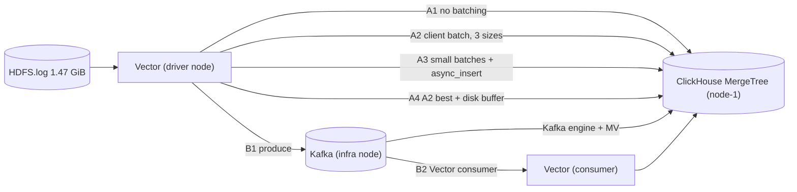

# Phase 1A — ClickHouse ingest architecture

A ClickHouse-only shakedown that runs before the four-engine [Phase 1](benchmark-plan.md).
It answers two pipeline questions with measurements instead of argument:

1. **Where does batching happen** — in the agent, in the server via `async_insert`, or in a
   broker?
2. **Do we need Kafka in front of ClickHouse?** This is the question
   [syscon.txt](syscon.txt) line 98 raised and nobody answered.

Companion documents: [benchmark-plan.md](benchmark-plan.md) (criteria, rig, fairness rules),
[corpus-spec.md](corpus-spec.md) (the synthetic 500GB corpus and the ClickHouse schema this
one is derived from), [phase1a/linux/DRILLS.md](phase1a/linux/DRILLS.md) (the failure runbook).

The harness is split by machine. [phase1a/linux](phase1a/linux/driver/replay.sh) is this document:
the rig, cgroup CPU, page-cache drops, and the numbers the decision is allowed to use.
[phase1a/macos](phase1a/macos/driver/replay.sh) is a Docker smoke test on a laptop. It checks
the count gate and canary latency, writes `cpu_sec_per_gb: null`, and goes to
`results/phase1a-macos.ndjson`. Those records are not comparable with the rig and do not enter
the handbook. See [phase1a/README.md](phase1a/README.md).

---

## 1. Scope, and what these numbers are not

Phase 1A uses 1.47 GiB of real log data. That is enough to decide **pipeline shape** and to
surface parts and merge behaviour, and it is deliberately small so the whole matrix fits in
an afternoon instead of a rig week.

It is **not** a sizing measurement. No number from Phase 1A goes into the handbook's
per-TB/day sizing table, and none of it is comparable against another engine — there is no
other engine in this phase. Sizing still comes from the 500GB Phase 1. This paragraph exists
because a 1.47 GiB throughput figure is exactly the kind of number that gets quoted as a
capacity number six weeks later.

What does transfer out of Phase 1A:

- The batching configuration we run in production, and the visibility latency it costs.
- A yes/no on Kafka, with its price attached.
- Whichever pipeline the later 500GB ClickHouse run uses, so that run is not also a pipeline
  experiment.

---

## 2. Input

[data/HDFS.log](data/HDFS.log), the raw LogHub HDFS_v1 dataset. Verified locally rather than
taken from the LogHub table:

| Property | Value |
| --- | --- |
| Lines | 11,175,629 |
| Bytes | 1,577,982,906 (1.47 GiB) |
| SHA-256 | `0783096174d7832c618337f9609e06e04abd86ddd7089b3c12b407e63bfebc52` |
| First event | `2008-11-09 20:35:18` |
| Last event | `2008-11-11 11:16:28` |
| Distinct components | 9 |
| Distinct pids | 27,799 |
| Levels | INFO 10,812,836 / WARN 362,793 — **no ERROR lines at all** |

Line format, every one of the 11,175,629 lines matching
`^[0-9]{6} [0-9]{6} [0-9]+ [A-Z]+ [^:]+: ` (verified, zero exceptions):

```
081109 203518 143 INFO dfs.DataNode$DataXceiver: Receiving block blk_-1608999687919862906 src: /10.250.19.102:54106 dest: /10.250.19.102:50010
```

Four consequences that shape the rest of this document:

1. **The log's own timestamps cannot measure visibility latency.** They are
   second-granularity and eighteen years old. Ingest-to-visible comes from a separate canary
   carrying wall-clock time, plus an `IngestedAt DateTime64(3) DEFAULT now64(3)` column.
2. **Three calendar dates means three partitions** under `PARTITION BY toDate(Timestamp)`.
   Part counts per partition are one of the things being measured, so record that three
   partitions is not the shape seven days produces.
3. **The replayed row count must equal exactly 11,175,629** on every arm, counted excluding
   the canary rows of §7:

   ```sql
   SELECT count() FROM sysbench.logs_hdfs WHERE Component != 'sysbench.Canary';
   ```

   An arm that does not match is reporting a loss or duplication finding, not a fast run.
   This is the local equivalent of fairness rule 5.
4. **No ERROR lines**, so this slice cannot carry an error-rate alerting scenario. Irrelevant
   to Phase 1A, which is ingest only, but worth knowing before anyone reuses the slice for C4.

---

## 3. Rig layout

The rig from [benchmark-plan.md §2](benchmark-plan.md), with only ClickHouse running.

| Role | What runs on it |
| --- | --- |
| node-1 (SUT) | ClickHouse, single shard, plain MergeTree. Capped at 16 cores / 64GB via cgroup |
| node-2, node-3 | Idle at T1. Used only for the T2 confirmation pass |
| driver | Vector, the replay script, the canary injector |
| infra | Kafka — Kafka arms only |
| observer | Prometheus: `node_exporter`, ClickHouse metrics, Vector's Prometheus exporter, Kafka JMX. 5s scrape |

The cgroup cap is not optional. Without it ClickHouse gets all 32 cores here and 16 in the
later four-engine run, and the two sets of numbers stop relating to each other.

Kafka lives on the infra node so its CPU is measured as its own line item. If Kafka ran on
node-1 its cost would be charged to ClickHouse and the whole comparison would be rigged in
favour of the no-Kafka arms.

**Durability tier.** The arm matrix runs entirely at **T1** (plain MergeTree, single copy),
because the question is pipeline shape and T1 isolates it. The winning arm is then repeated
once at **T2** (`ReplicatedMergeTree` x2 + Keeper, per
[benchmark-plan.md §C3](benchmark-plan.md)) as a confirmation pass. Every result record
carries its tier (fairness rule 8).

---

## 4. The arm matrix



| Arm | Config | What it settles |
| --- | --- | --- |
| **A1** | `batch.max_events: 1` | The cost of not batching, as a number rather than an assertion |
| **A2s** | batch 1 MB / 1s | Small-batch end of the tradeoff |
| **A2m** | batch 10 MB / 5s | Vector's default-ish middle |
| **A2l** | batch 100 MB / 30s | Large-batch end: best throughput, worst visibility |
| **A3w1** | small batches + `async_insert=1`, `wait_for_async_insert=1` | Server-side batching with a durable ack |
| **A3w0** | same, `wait_for_async_insert=0` | Where acked-but-lost shows up |
| **A4** | A2's best size + `buffer.type: disk` | The cheap alternative to Kafka |
| **B1** | Vector → Kafka → ClickHouse `Kafka` engine + MV | Kafka, idiomatic ClickHouse version |
| **B2** | Vector → Kafka → Vector consumer → ClickHouse | Optional. Only if B1 looks promising |

Configs live in [phase1a/linux/vector/](phase1a/linux/vector/README.md), one self-contained file per arm.
They are deliberately not layered onto a shared base: fairness rule 9 requires every
non-default setting to be recorded with the result, and a flat file is a recordable artifact in
a way that a merge of three includes is not.

The server-side halves live alongside them:
[ddl.sql](phase1a/clickhouse/ddl.sql) for every arm,
[async-insert.sql](phase1a/clickhouse/async-insert.sql) for A3,
[kafka-engine.sql](phase1a/clickhouse/kafka-engine.sql) for B1, and
[reset.sql](phase1a/clickhouse/reset.sql) between repetitions.

A3 is the one arm whose configuration is **not** in its Vector file. Vector's ClickHouse sink
cannot set `async_insert`, so the setting is attached to the user Vector authenticates as, and
A3w1 and A3w0 share a byte-identical Vector config. Both sub-arms must be checked for
`async_insert_flushes > 0` afterwards; a typo in the user's settings would otherwise produce an
ordinary synchronous arm wearing A3's label.

### A1 needs a stopping rule

`batch.max_events: 1` sends roughly 11 million single-row inserts. ClickHouse will hit
`TOO_MANY_PARTS` long before the file ends, so A1 is capped at **10 minutes or 200,000
events, whichever comes first**, and reported as *events accepted before first failure* plus
the parts count at that moment. There is no completion time for A1 and we should not wait for
one.

### What is held constant

- **Parsing happens in Vector**, via the VRL transform in every config, never in ClickHouse.
  Parsing is real CPU and moving it between agent and engine would confound every arm.
- **Replay rate is fixed at 50,000 events/s** (~7 MB/s, ~3.7 minutes per pass) for the
  comparison runs. Rate limiting is done by `pv -l -L` in the driver, not by Vector's
  `throttle` transform — `throttle` *drops* events over the threshold, which would break the
  exact-count assertion in §2.
- **One unthrottled pass per arm** in addition, to find max throughput.
- **Three repetitions**, median and p95 reported, cold start between runs: restart ClickHouse,
  `sync`, drop page cache, `DROP TABLE`, recreate (fairness rules 3 and 4).
- **`request.concurrency` pinned** rather than left adaptive, so the arms differ in batching
  and nothing else.

---

## 5. Schema

The ClickHouse DDL in [corpus-spec.md §10](corpus-spec.md) reduced to the fields HDFS
actually has, keeping the same shape — `LowCardinality` identity columns, a text index on the
message body, explicit day partitioning, identity-then-time sort order — so conclusions carry
over to the real corpus. Full DDL in [phase1a/clickhouse/ddl.sql](phase1a/clickhouse/ddl.sql).

```sql
CREATE TABLE logs_hdfs
(
    Timestamp   DateTime('UTC'),
    IngestedAt  DateTime64(3, 'UTC') DEFAULT now64(3),
    Pid         UInt32,
    Level       LowCardinality(String),
    Component   LowCardinality(String),
    Body        String,
    INDEX idx_body Body TYPE text(tokenizer = 'splitByNonAlpha') GRANULARITY 64
)
ENGINE = MergeTree
PARTITION BY toDate(Timestamp)
ORDER BY (Component, Timestamp);
```

Notes on the deviations:

- `DateTime('UTC')` rather than a bare `DateTime`, which would be interpreted in the server
  timezone and make the partition boundaries depend on where the rig happens to be.
- `ORDER BY (Component, Timestamp)` mirrors the corpus's identity-then-time order. With nine
  components it is a weak sort key, which is worth stating: real `(Cluster, Namespace, App)`
  has far more structure, so Phase 1A will slightly understate compression.
- `IngestedAt` has no equivalent in the corpus schema. It exists so visibility latency can be
  computed server-side, and it is the one column Phase 1A adds.
- The text index requires ClickHouse **>= 26.2** ([benchmark-plan.md §Candidates](benchmark-plan.md)).
  It is present because insert-time index construction is part of the write cost being
  measured, not something to be added later.

---

## 6. Metrics

Recorded per run, per arm.

| Metric | Source | Why |
| --- | --- | --- |
| Events/s, MB/s, and per core | driver wall time + cgroup CPU | throughput |
| **CPU-seconds per GB, split across Vector / Kafka / ClickHouse** | `node_exporter` + cgroup accounting | the honest cost comparison |
| **Ingest-to-visible p50/p99** | canary, see §7 | the metric that separates the arms |
| Parts created per GB, merges, merge duration | `system.part_log` | merge pressure |
| `TOO_MANY_PARTS` and any other errors | `system.errors` | the A1 failure mode |
| Async insert queue behaviour | `system.asynchronous_insert_log` | A3 only |
| Consumer lag, assignments, exceptions | `system.kafka_consumers` | B1 only |
| On-disk bytes per raw GB after merges settle | `system.parts` | storage efficiency |
| Buffer depth, discarded events, errors | Vector Prometheus exporter | backpressure on the agent side |
| Final row count | `SELECT count()` | the §2 gate |

**CPU-seconds per GB is summed across all three components, and also reported split.** The
split is the whole point of the Kafka question: a broker's cost is real, it simply lives on
another machine, and a single-number comparison would hide it.

Collection queries: [phase1a/collect.sql](phase1a/collect.sql).

---

## 7. Measuring ingest-to-visible latency

A low-rate canary stream shares the arm's pipeline, and latency is read off the table rather
than discovered by polling.

1. Once per second during the run, [phase1a/linux/driver/canary.sh](phase1a/linux/driver/canary.sh) emits
   one line in the real HDFS format — component `sysbench.Canary`, `Body` carrying the marker
   `zzqcanary` plus the driver's wall-clock time in milliseconds. It enters through a dedicated
   `socket` source rather than being interleaved into stdin, but it then flows through the same
   VRL transform and, critically, the **same sink batch** as the bulk replay. That is what
   makes it measure the arm instead of a side channel.
2. Latency per canary row is `IngestedAt - emit_ms`, computed in
   [phase1a/collect.sql](phase1a/collect.sql). `IngestedAt` is `DEFAULT now64(3)`, evaluated
   server-side during insert processing, which is the moment the row becomes visible.

There is deliberately **no polling loop**. Polling would be bounded by its own interval and,
worse, would add query load to the thing being measured. Reading `IngestedAt` is both more
precise and free.

Two caveats that the harness handles rather than ignores:

- **Clock skew.** `emit_ms` comes from the driver and `IngestedAt` from node-1, so a 200ms skew
  would silently become 200ms of "visibility latency". `replay.sh` estimates the offset per run
  by sandwiching a server-side `now64(3)` between two local reads, records it as
  `clock_offset_ms`, and subtracts it. The rig still needs working NTP; this only catches what
  NTP leaves behind.
- **`now64(3)` is evaluated just before commit**, not at it, so the measurement understates
  true visibility by the commit itself — sub-millisecond to a few milliseconds. Irrelevant
  against batch timeouts measured in seconds, but it is the direction of the error.

Canary rows are excluded from the count gate in §2 and from on-disk byte accounting. At one per
second over a ~3.7 minute pass there are only ~220 of them, but they are excluded by predicate
rather than by estimate. The line is dated `081111 111628` — the corpus's last event — on
purpose: today's date would create a fourth partition and change the merge behaviour under
measurement.

This is the concrete version of what [explanation.md §4.2](explanation.md) asked for: stop
arguing from architecture about ClickHouse parts versus Elasticsearch refresh, and measure
the number at the batching configuration we would actually run. The expected shape of the
result is that visibility latency tracks `batch.timeout_secs` almost exactly, which would
confirm the delay is a pipeline choice rather than an engine property.

Scripts: [phase1a/linux/driver/canary.sh](phase1a/linux/driver/canary.sh). The macOS smoke test emits the
same line from [phase1a/macos/driver/canary.py](phase1a/macos/driver/canary.py), because macOS
has neither `date +%s%3N` nor bash `/dev/tcp`.

---

## 8. Failure drills

At 1.47 GiB Kafka cannot win on throughput. A throughput-only comparison would therefore
conclude "Kafka is pure overhead", which is the wrong answer arrived at honestly — Kafka is
bought for decoupling and replay, and neither shows up in a run where nothing breaks.

The drills are in [phase1a/linux/DRILLS.md](phase1a/linux/DRILLS.md) and run against A2, A4 and B1:

- **D1 — ClickHouse stopped for 5 minutes mid-ingest.** Does the agent buffer or drop? How
  long to catch up? Is the final count still 11,175,629?
- **D2 — `kill -9` ClickHouse mid-ingest.** Count acked-but-lost. Expected to be the arm that
  disqualifies A3w0.
- **D3 — Kafka replay after crash.** Confirm offsets replay without loss, and count
  **duplicates**: the `Kafka` table engine is at-least-once, so duplicate rows are the
  expected result, and the cost of deduplicating them is part of Kafka's price rather than a
  footnote.

---

## 9. Decision rule

Ranked in advance so the result is read rather than argued.

1. **Gate: no acked-but-lost data.** An arm that loses acked records is out regardless of how
   fast it was. This mirrors the phase-1 stopping condition in
   [benchmark-plan.md §6](benchmark-plan.md).
2. **Ingest-to-visible p99 within the stated SLO.** Starting value **10 seconds**, to be
   confirmed before the first run, not after seeing the numbers.
3. **Lowest summed CPU-seconds per GB** across agent, broker and engine.
4. **Lowest merge pressure** — parts per GB, no `TOO_MANY_PARTS`.
5. **Operability**, as the tiebreak: component count, lines of non-default config, and what
   breaks when ClickHouse restarts.

Output is a recommended pipeline plus a Kafka verdict stated as a tradeoff rather than a
preference:

> Kafka buys N minutes of ClickHouse downtime tolerance and offset replay, for M extra
> CPU-seconds per GB, K seconds of added p99 visibility latency, one more clustered system to
> operate, and a deduplication requirement.

If A4 (agent disk buffer) clears the gate and absorbs the D1 outage, the honest conclusion is
that Kafka is not required for this workload, and the recommendation should say so with the
downtime number that backs it.

---

## 10. Results

One JSON record per run appended to `results/phase1a.ndjson`, consistent with
[benchmark-plan.md §5](benchmark-plan.md):

Emitted by [phase1a/linux/driver/replay.sh](phase1a/linux/driver/replay.sh); values below are illustrative,
not measured.

```json
{
    "phase": "1a",
    "engine": "clickhouse",
    "tier": "T1",
    "host": "linux",
  "arm": "a2m",
  "pipeline": "vector-direct",
  "repetition": 1,
  "cache_state": "cold",
  "mode": "throttled",
  "replay_rate_events_per_sec": 50000,
  "async_insert": false,
  "wait_for_async_insert": null,
  "kafka": false,
  "rows_expected": 11175629,
  "rows_actual": 11175629,
  "row_delta": 0,
  "parse_failures": 0,
  "wall_time_sec": 228.4,
  "events_per_sec": 48930,
  "cpu_sec_per_gb": {
    "vector": 26.14, "kafka": 0, "clickhouse": 61.15, "total": 87.29
  },
  "visible_latency_ms": { "p50": 2100, "p99": 5300 },
  "canary_rows": 220,
  "parts_created": 412,
  "merges": 180,
  "merge_seconds": 95.5,
  "active_parts": 9,
  "partitions": 3,
  "on_disk_bytes": 233445566,
  "too_many_parts_errors": 0,
  "async_insert_flushes": 0,
  "kafka_messages_read": 0,
  "kafka_last_exception": "",
  "acked_but_lost": null,
  "duplicates": null,
  "run_start": "2026-09-29 12:00:00",
  "clock_offset_ms": -3,
  "corpus_sha256": "0783096174d7832c618337f9609e06e04abd86ddd7089b3c12b407e63bfebc52",
  "non_default_config": { "vector_config": "...", "clickhouse_user": "default" }
}
```

`non_default_config.vector_config` carries the **entire** config file verbatim, not a summary,
so a number can always be traced back to the exact configuration that produced it without
relying on the repo being at the right commit.

`acked_but_lost` and `duplicates` are null on clean runs. They are only meaningful under the
drills, which append to `results/phase1a-drills.ndjson` with their own record shape — see
[phase1a/linux/DRILLS.md](phase1a/linux/DRILLS.md). The macOS smoke test writes the same shape
with `host: "macos"`, `cache_state: "docker"` and `cpu_sec_per_gb: null`, to
`results/phase1a-macos.ndjson`.

## 11. Run order

```bash
phase1a/linux/driver/replay.sh a2m 1 throttled    # rig
phase1a/macos/driver/replay.sh a2m 1 throttled    # laptop smoke test
```

1. `a1` once — it is a demonstration, not a measurement, and three repetitions of a known
   failure buy nothing.
2. `a2s`, `a2m`, `a2l` x 3 repetitions, throttled, then one unthrottled pass each. Pick the
   winner before continuing: A4 is defined as "the winning A2 plus a disk buffer", so running
   it first would make it uninterpretable.
3. `a4` x 3 throttled + 1 unthrottled, with `batch.*` set to the winning A2 size.
4. `a3w1`, `a3w0` x 3 throttled. Confirm `async_insert_flushes > 0` or the arm is void.
5. `b1` x 3 throttled + 1 unthrottled.
6. Drills D1 and D2 on `a2m`, `a4`, `a3w1`, `a3w0`; D3 on `b1`.
7. `b2` only if B1 is still competitive after the drills.
8. The winning arm once at T2.
